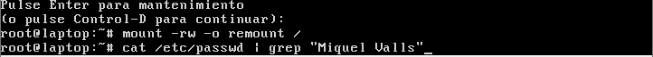

# T03: Seguretat Lògica: recuperant accés a sistemes

Per recuperar la contrasenya, el primer pas serà entrar al menú d’opcions avançades de Zorin.

Després de donar-li a opcions avançades, entrarem dins de **Zorin with Linux 6.8.0-85-generic (recovery mode)**.ç

Ens sortirà aquest menú, on li donarem a **root** per poder tenir permisos de superusuari.

Amb aquesta comanda tornarem a muntar el sistema.

Després, amb la comanda **passwd**, tornarem a inserir una contrasenya.

Amb la comanda **grub** crearem un hash a partir d’una contrasenya.

La qüestió és que necessitarem copiar tot el text, però no és gaire còmode; llavors utilitzarem aquesta comanda per copiar-lo.

Després obrirem l'arxiu **40_custom**.

[Per fer els següents passos necessitarem obrir l’editor d’arxius.]

On introduirem el següent:

set superusers="nombre_login"

password_pbkdf2 nombre_login

I després, per últim, aplicarem els canvis.
